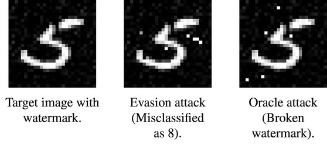

# Adversarial Machine Learning & Digital Watermarking

This repository belongs to our publication:

---

Erwin Quiring, Daniel Arp, and Konrad Rieck. Forgotten Siblings: Unifying Attacks on Machine Learning and Digital Watermarking. *Proc. of 3rd IEEE European Symposium on Security and Privacy (EuroS&P)*, April 2018.

---

You can find the code and datasets from our case studies in this repository, and a copy of our paper
[here](https://www.tu-braunschweig.de/Medien-DB/sec-team/erwin/mlmeetswat_eurosp2018.pdf).

## Background
Machine learning is increasingly used in security-critical applications, such as autonomous driving, face recognition and malware detection. Most learning methods, however, have not been designed with security in mind and thus are vulnerable to different types of attacks. This problem has motivated the research field of **adversarial machine learning** that is concerned with attacking and defending learning methods.
A separate line of research has tackled a very similar problem: In **digital watermarking**, a pattern is embedded in a signal like an image or audio file in the presence of an adversary. As a consequence, this research field has also extensively studied techniques for attacking and defending watermarking methods.

## Unifying Attacks
The two research communities have worked in parallel so far, unnoticeably developing similar attack and defense strategies. This paper is a first effort to bring these communities together. The following images show an attack against a learning method (middle) and a watermark detector (right). Surprisingly, both attacks follow a similar strategy although their goals and underlying techniques are fundamentally different. Although the example only illustrates a single attack type based on images,
it becomes apparent that there is a conceptual similarity between learning and watermarking attacks.

We strive for bringing both fields together. To this end,
- we systematically study the similarities of attacks and defenses between machine learning and digital watermarking by introducing a *unified notation*.
- we empirically demonstrate the efficacy of this unified view
in three *case studies*. We apply concepts from watermarking to machine learning and vice versa.

In this way, we further promote the idea of combining research fields that work in an adversarial environment (the notion of *Adversarial Signal Processing*, as proposed by M. Barni and F. Pérez-González).

## Structure
You find the code and datasets for two case studies in the following two directories:

1. In *CaseStudy_Attack*, you find our first case study where
we transfered concepts from adversarial learning to attack the watermarking
scheme Broken Arrows.

2. In *CaseStudy_Defense*, you find our third case study
where we transfered the closeness-to-the-boundary concept to mitigate model-extraction
attacks on decision trees.

In each directory, you will find another README with more details.
